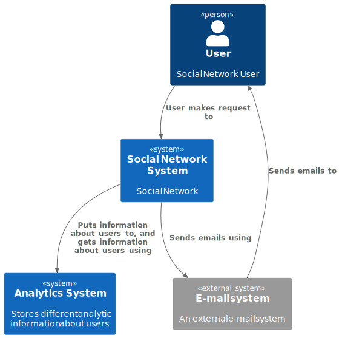

  

   
  <h1 align="center">Social Network System Design</h3>

  ### Functional requirements:

  - user can add and delete friends
  - any person can see user's info and friends
  - user can draft a post, upload media files to a post and publish a drafted post
  - user can see their feed and the feed of any other user
  - user can see their dialogs and send messages to any their dialog
  - user can see their chats and send messages to any their chat

  ### Non-functional requirements:

  - 10 000 000 DAU
  - availability 99,95%
  - service operation time 5 years
  - each user writes 2 messages a day
  - each user reads 10 messages a day
  - each user publishes 1 post a week
  - each user reads 10 posts a week
  - maximum post length is 1000 characters
  - maximum message length is 1000 characters
  - maximum media file size is 5 MB
  - the number of media files attached to a post is limited to 1

  ## Design overview

  For system design I have  used [C4 model](https://c4model.com/). The C4 model was created as a way 
  to help software development teams describe and communicate software 
  architecture, both during up-front design sessions and when retrospectively 
  documenting an existing codebase. It's a way to create maps of your code, 
  at various levels of detail, in the same way you would use something like 
  Google Maps to zoom in and out of an area you are interested in.

  

       <b>Level 1.</b> System context diagram  
  

  

    
  

  ## Basic calculations

  Messages RPS (read):

    DAU = 10 000 000
    Each user reads 10 messages per day
    RPS = 10 000 000 / 86 400 * 10 ~= 1160

  Messages RPS (write):

    DAU = 10 000 000
    Each user writes 2 messages per day
    RPS = 10 000 000 / 86 400 * 2 ~= 232

  Posts RPS (read):

    DAU = 10 000 000
    Each user reads 10 posts per week
    RPS = 10 000 000 / 86 400 / 7 * 10 ~= 165

  Posts traffic (incoming):

    DAU = 10 000 000
    Each user publishes 1 post a week
    Maximum post length is 1000 characters
    Maximum media file size is 5 MB
    One post size = 2 KB + 5 MB ~= 5.2 MB
    Incoming traffic per second = 10 000 000 / 86 400 / 7 * 5.2 ~= 86 MB/s

  Number of disks:

    Total posts memory for 5 years = 86 * 86 400 * 365 * 5 ~= 13 PB (petabyte)
    Number of 12 TB HDD disks = 13 000 / 12 ~= 1 084

  Required memory:

    DAU = 10 000 000
    Each user writes 2 messages per day
    Service operation time 5 years
    Maximum message length is 1000 characters
    Sent messages for 5 years = 2 * 365 * 5 ~= 3650
    Message size ~= 2 KB
    Database size = 2 * 3650 ~= 7.3 MB

 

  Social Network API for a System Design Course
   
  <a href="https://github.com/chistyakoviv/social_network_system_design/api/rest_api.yml"><strong>Explore the project »</strong></a>
   
   
  <a href="https://github.com/chistyakoviv/social_network_system_design/issues">Report Bug</a>
  ·
  <a href="https://github.com/chistyakoviv/social_network_system_design/issues">Request Feature</a>

